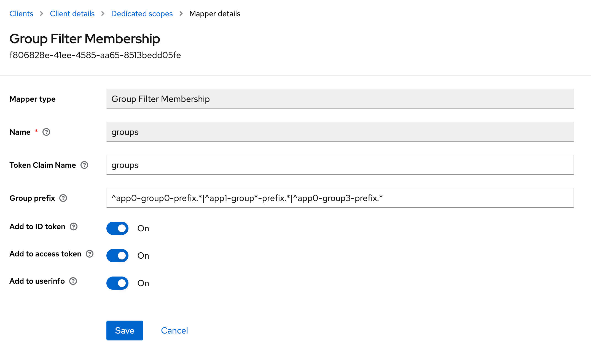

[](https://github.com/mrDFX/keycloak-regex-filter-group-mapper/blob/main/CONTRIBUTING.md)
# Keycloak OpenId Connect (OIDC) group filter mapper
Custom protocol claim mapper that adds the filtrated by regexp groups.
## Keycloak version

This plugin currently uses the keycloak library in version 20.0.3, so it should be compatible with keycloak instances up to that version.

## Install
To build the jar file, simply run
```
mvn clean package
```

If using the official keycloak docker image you can create a mount of the directory /opt/jboss/keycloak/standalone/deployments and copy the jar there.
Or using the unofficial keycloak docker image (like https://hub.docker.com/r/bitnami/keycloak) you can past the jar there  - /opt/bitnami/keycloak/providers/

## Usage
After successful installation the mapper is available for any client in tab "Mappers" (see also in the official [keycloak documentation](https://www.keycloak.org/docs/latest/server_admin/index.html#_protocol-mappers)).

To create new protocol mapper -> select "Group Filter Membership (UUID)" -> insert name -> done.
In your "REALM" select "clients" -> select "client"(OIDC) f.e.: $client_name -> select "Client Scopes" -> in "Assigned client scope" - select $client_name-dedicated -> push button "Add mapper" and select "By configuration" -> Choose mapper type with name "Group Filter Membership" of the mappings from this table -> next in opened screen "Mapper details" MUST to fill fields:
"Name" - any name for representation in mappers list on keycloak client ui side;
"Token Claim Name" - Name of the claim to insert into the token ; (empty value – 5XX answers - bug/fitcha)
"Group prefix" - any PCRE regexp for filtering groups

## Example usage
In this field, you must specify the regexp by which groups within the given REALM will be filtered.
Any regular expression (PCRE) must begin with the character "^" .
Example:
if there are groups with the following names:
```
g1-a-a1
g1-a-a2
g1-b-a1
g1-b-a3
g1-c-a1
g1-c-a3
```
- and for this client, only groups are needed:
1. Beginning with g1-a-a
2. All groups starting with g1- and ending with -a3
- for this, a regexp of the type is suitable:
^g1-a-a.+|^g1-.+-a3.+


 

